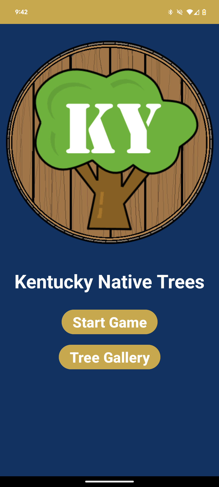

## KY Native Tree Guessing Game

A fun and educational game where you guess the native trees of Kentucky! Designed to test your knowledge.

I created this mobile app with the goal of combining educational content with an engaging gamified experience.

## Features
- Guess the native tree based on provided images.
- Track your high score and current streak.
- Access a gallery of native tree names for further exploration or learning.
- Responsive design for various screen sizes.

## Screenshots
{: style="width:300px; height:auto;"}
{: style="width:300px; height:auto;"}
{: style="width:300px; height:auto;"}

## Installation
- Clone the repository:
- Open the project in Android Studio.
- Build and run the project on an Android device or emulator.

## Usage
- Launch the app.
- Start the game by tapping the "Start Game" button on the main screen.
1.  Choose the correct tree name among the options provided.
2.  Navigate to the tree gallery to explore all available native tree names.
